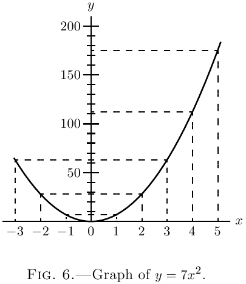
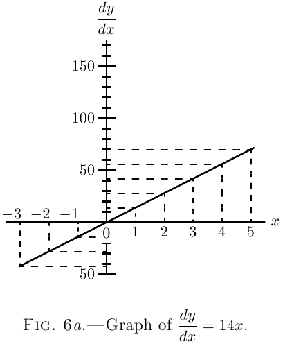

# 第五章 下一阶段：如何处理常数

在我们的方程中，我们把 $x$ 看作是增长的变量，由于 $x$ 的增长，$y$ 也改变了它的值并增长。我们通常把 $x$ 看作一个可以变化的量；我们把 $x$ 的变化看作一种*原因*，把由此产生的 $y$ 的变化看作*结果*。换句话说，我们认为 $y$ 的值依赖于 $x$ 的值。$x$ 和 $y$ 都是变量，但 $x$ 是我们操作的变量，而 $y$ 是"因变量"。在前面所有章节中，我们一直在试图找出因变量 $y$ 的变化与自变量 $x$ 的变化之间的比例关系的规律。

我们的下一步是找出*常数*的存在对微分过程产生什么影响，也就是说，当 $x$ 或 $y$ 改变它们的值时，那些数值不变的数字会产生什么影响。

**相加常数。** 让我们从一个简单的相加常数例子开始：

设
$$
\begin{aligned} 
y=x^3+5. 
\end{aligned} 
$$

正如以前一样，假设 $x$ 增长到 $x+dx$，$y$ 增长到 $y+dy$。

$$
\begin{aligned}
\text{那么：}\; y + dy &= (x + dx)^3 + 5 \\
&= x^3 + 3x^2\, dx + 3x(dx)^2 + (dx)^3 + 5. 
\end{aligned} 
$$

忽略高阶小量，这就变成了

$$ 
\begin{aligned} 
y + dy &= x^3 + 3x^2·dx + 5. \\ 
\end{aligned} 
$$

减去原来的 $y = x^3 + 5$，我们得到：

$$
\begin{aligned} 
dy &= 3x^2\, dx. \\ 
\frac{dy}{dx} &= 3x^2. 
\end{aligned}
$$

所以常数 $5$ 完全消失了。它对 $x$ 的增长没有贡献，不会出现在导数中。如果我们用 $7$、$700$ 或任何其他数字代替 $5$，它都会消失。所以如果我们用字母 $a$、$b$ 或 $c$ 来表示任何常数，当我们求导时它都会简单地消失。

如果附加常数是负值，比如 $-5$ 或 $-b$，它同样会消失。

**相乘常数。** 作为一个简单的实验，取这个例子：

设 $y = 7x^2$。然后按照前面的方法我们得到：

$$
\begin{aligned} 
y + dy &= 7(x+dx)^2 \\
&= 7\{x^2 + 2x·dx + (dx)^2\} \\
&= 7x^2 + 14x·dx + 7(dx)^2. \\ 
\end{aligned}
$$

然后，减去原来的 $y = 7x^2$，并忽略最后一项，我们有

$$
\begin{aligned}
dy &= 14x·dx.\\ 
\frac{dy}{dx} &= 14x. 
\end{aligned}
$$

让我们通过绘制方程 $y = 7x^2$ 和 $\dfrac{dy}{dx} = 14x$ 的图形来说明这个例子，给 $x$ 赋予一系列连续的值：$0$、$1$、$2$、$3$ 等，并求出 $y$ 和 $\dfrac{dy}{dx}$ 的相应值。

我们将这些值列表如下：

|$x$|$0$|$1$|$2$|$3$|$4$|$5$|$-1$|$-2$|$-3$|
|---|---|---|---|---|---|---|---|---|---|
|$y$|$0$|$7$|$28$|$63$|$112$|$175$|$7$|$28$|$63$|
|$\dfrac{dy}{dx}$|$0$|$14$|$28$|$42$|$56$|$70$|$-14$|$-28$|$-42$|

 

现在按某个合适的比例绘制这些值，我们得到两条曲线：图6和图6a。

 

仔细比较这两个图形，并通过观察验证：导函数曲线（图6a）的纵坐标高度与原曲线（图6）在相应 $x$ 值处的*斜率*成正比。（关于曲线的*斜率*，参见相关章节。）在原点左侧，原曲线的斜率为负（即从左到右向下倾斜），导函数曲线的相应纵坐标也是负的。

现在如果我们回顾前面的内容，我们会看到简单地对 $x^2$ 求导得到 $2x$。所以 $7x^2$ 的导数恰好是 $x^2$ 的导数的 $7$ 倍。如果我们取 $8x^2$，导数就会是 $x^2$ 的导数的八倍。如果我们设 $y = ax^2$，我们将得到
$$\frac{dy}{dx} = a × 2x.$$

如果我们从 $y = ax^n$ 开始，我们应该得到 $\dfrac{dy}{dx} = a×nx^{n-1}$。所以任何简单的常数乘法在求导时会重新出现为简单的乘法。而且，乘法的规律同样适用于*除法*：因为如果在上面的例子中，我们取常数 $\frac{1}{7}$ 而不是 $7$，我们应该在求导后的结果中得到同样的 $\frac{1}{7}$。

**一些进一步的例子。** 下面这些充分展开的例子将使你能够完全掌握应用于普通代数表达式的微分过程，并使你能够自己解决本章末尾给出的例题。

(1) 对 $y = \dfrac{x^5}{7} - \dfrac{3}{5}$ 求导。

$\dfrac{3}{5}$ 是一个相加常数，会消失（参见前面关于相加常数的内容）。

我们可以立即写出
$$\frac{dy}{dx} = \frac{1}{7} × 5 × x^{5-1},$$
或者
$$\frac{dy}{dx} = \frac{5}{7} x^4.$$

(2) 对 $y = a\sqrt{x} - \dfrac{1}{2}\sqrt{a}$ 求导。

项 $\dfrac{1}{2}\sqrt{a}$ 消失，因为它是一个相加常数；而 $a\sqrt{x}$ 用指数形式写成 $ax^{\frac{1}{2}}$，我们有
$$\frac{dy}{dx} = a × \frac{1}{2} × x^{\frac{1}{2}-1} = \frac{a}{2} × x^{-\frac{1}{2}},$$
或者
$$\frac{dy}{dx} = \frac{a}{2\sqrt{x}}.$$

(3) 如果 $ay + bx = by - ax + (x+y)\sqrt{a^2 - b^2}$，求 $y$ 对 $x$ 的导数。

作为一般规则，这种类型的表达式需要比我们目前掌握的更多知识；

然而，试试看表达式是否能化为更简单的形式总是值得的。

首先我们必须试图将它化为 $y = {}$ 仅包含 $x$ 的某个表达式的形式。

这个表达式可以写成
$$(a-b)y + (a + b)x = (x+y) \sqrt{a^2 - b^2}.$$

两边平方，我们得到
$$(a-b)^2 y^2 + (a + b)^2 x^2 + 2(a+b)(a-b)xy = (x^2+y^2+2xy)(a^2-b^2),$$
这简化为

$$
\begin{aligned} 
(a-b)^2y^2 + (a+b)^2 x^2 &= x^2(a^2 - b^2) + y^2(a^2 - b^2); \\ 
\text{或者}\; [(a-b)^2 - (a^2 - b^2)]y^2 &= [(a^2 - b^2) - (a+b)^2]x^2, \\ 
\text{即}\; 2b(b-a)y^2 &= -2b(b+a)x^2; 
\end{aligned}
$$

因此
$$y = \sqrt{\frac{a+b}{a-b}} x \quad\text{和}\quad \frac{dy}{dx} = \sqrt{\frac{a+b}{a-b}}.$$

(4) 半径为 $r$、高为 $h$ 的圆柱体的体积由公式 $V = \pi r^2 h$ 给出。当 $r = 5.5$ 英寸，$h=20$ 英寸时，求体积对半径的变化率。如果 $r = h$，求圆柱体的尺寸，使得半径变化 $1$ 英寸会引起体积变化 $400$ 立方英寸。

$V$ 对 $r$ 的变化率是
$$\frac{dV}{dr} = 2 \pi r h.$$

如果 $r = 5.5$ 英寸，$h=20$ 英寸，这就变成 $690.8$。这意味着半径变化 1 英寸将引起体积变化 $690.8$ 立方英寸。这可以很容易地验证，因为当 $r = 5$ 和 $r = 6$ 时的体积分别是 $1570$ 立方英寸和 $2260.8$ 立方英寸，而 $2260.8 - 1570 = 690.8$。

另外，如果
$$r=h,\quad \dfrac{dV}{dr} = 2\pi r^2 = 400\quad \text{且}\quad r = h = \sqrt{\dfrac{400}{2\pi}} = 7.98 \text{英寸}.$$

(5) 费里辐射高温计的读数 $\theta$ 与被观测物体的摄氏温度 $t$ 之间的关系为
$$\dfrac{\theta}{\theta_1} = \left(\dfrac{t}{t_1}\right)^4,$$
其中 $\theta_1$ 是对应于被观测物体已知温度 $t_1$ 的读数。

比较高温计在温度 $800°$C、$1000°$C、$1200°$C 时的灵敏度，已知当温度为 $1000°$C 时读数为 $25$。

灵敏度是读数对温度的变化率，即 $\dfrac{d\theta}{dt}$。公式可以写成
$$\theta = \dfrac{\theta_1}{t_1^4} t^4 = \dfrac{25t^4}{1000^4},$$
我们有
$$\dfrac{d\theta}{dt} = \dfrac{100t^3}{1000^4} = \dfrac{t^3}{10,000,000,000}.$$

当 $t=800$、$1000$ 和 $1200$ 时，我们得到 $\dfrac{d\theta}{dt}$ 分别为 $0.0512$、$0.1$ 和 $0.1728$。

灵敏度从 $800°$ 到 $1000°$ 大约翻倍，到 $1200°$ 时又增加了四分之三。

---

### 练习题 II

对下列函数求导：

(1) $y = ax^3 + 6$。  
(2) $y = 13x^{\frac{3}{2}} - c$。  

(3) $y = 12x^{\frac{1}{2}} + c^{\frac{1}{2}}$。   
(4) $y = c^{\frac{1}{2}} x^{\frac{1}{2}}$。  

(5) $u = \dfrac{az^n - 1}{c}$。   
(6) $y = 1.18t^2 + 22.4$。  

自己编一些其他例子，试着对它们求导。

(7) 如果 $l_t$ 和 $l_0$ 分别是铁棒在温度 $t°$C 和 $0°$C 时的长度，那么 $l_t = l_0(1 + 0.000012t)$。求铁棒每摄氏度的长度变化。

(8) 已发现如果 $c$ 是白炽电灯的烛光，$V$ 是电压，则 $c = aV^b$，其中 $a$ 和 $b$ 是常数。

求烛光对电压的变化率，并计算在 $a = 0.5×10^{-10}$，$b=6$ 的灯泡中，$80$、$100$ 和 $120$ 伏时每伏特的烛光变化。

(9) 直径为 $D$、长度为 $L$、比重为 $\sigma$、在力 $T$ 作用下拉紧的弦的振动频率 $n$ 由下式给出：
$$n = \dfrac{1}{DL} \sqrt{\dfrac{gT}{\pi\sigma}}.$$

求当 $D$、$L$、$\sigma$ 和 $T$ 分别单独变化时频率的变化率。

(10) 管子能承受而不坍塌的最大外压 $P$ 由下式给出：  
$$P = \left(\dfrac{2E}{1-\sigma^2}\right) \dfrac{t^3}{D^3},$$
其中 $E$ 和 $\sigma$ 是常数，$t$ 是管壁厚度，$D$ 是直径。（此公式假设 $4t$ 与 $D$ 相比很小。）

比较厚度的微小变化和直径的微小变化分别发生时 $P$ 的变化率。

(11) 从基本原理求出下列量对半径变化的变化率：

(a) 半径为 $r$ 的圆的周长；(b) 半径为 $r$ 的圆的面积；(c) 母线长为 $l$ 的圆锥的侧面积；(d) 半径为 $r$、高为 $h$ 的圆锥的体积；(e) 半径为 $r$ 的球的表面积；(f) 半径为 $r$ 的球的体积。

(12) 铁棒在温度 $T$ 时的长度 $L$ 由 $L = l_t\bigl[1 + 0.000012(T-t)\bigr]$ 给出，其中 $l_t$ 是在温度 $t$ 时的长度，求适合套装在轮子上的铁箍直径 $D$ 当温度 $T$ 变化时的变化率。

### 答案

(1) $\dfrac{dy}{dx} = 3ax^2$。   
(2) $\dfrac{dy}{dx} = 13 × \frac{3}{2}x^{\frac{1}{2}}$。   
(3) $\dfrac{dy}{dx} = 6x^{-\frac{1}{2}}$。   
(4) $\dfrac{dy}{dx} = \dfrac{1}{2}c^{\frac{1}{2}} x^{-\frac{1}{2}}$。   
(5) $\dfrac{du}{dz} = \dfrac{an}{c} z^{n-1}$。   
(6) $\dfrac{dy}{dt} = 2.36t$。   
(7) $\dfrac{dl_t}{dt} = 0.000012×l_0$。   
(8) $\dfrac{dC}{dV} = abV^{b-1}$，分别为 $0.98$、$3.00$ 和 $7.47$ 烛光每伏特。   
(9)   
$$\dfrac{dn}{dD} = -\dfrac{1}{LD^2} \sqrt{\dfrac{gT}{\pi \sigma}}, \quad \dfrac{dn}{dL} = -\dfrac{1}{DL^2} \sqrt{\dfrac{gT}{\pi \sigma}},$$  
$$\dfrac{dn}{d \sigma} = -\dfrac{1}{2DL} \sqrt{\dfrac{gT}{\pi \sigma^3}}, \quad \dfrac{dn}{dT} = \dfrac{1}{2DL} \sqrt{\dfrac{g}{\pi \sigma T}}.$$  

(10)   
$$\dfrac{\text{$t$ 变化时 $P$ 的变化率}}{\text{$D$ 变化时 $P$ 的变化率}} = - \dfrac{D}{t}$$

(11) $2\pi$，$2\pi r$，$\pi l$，$\frac{2}{3}\pi rh$，$8\pi r$，$4\pi r^2$。  
(12) $\dfrac{dD}{dT} = \dfrac{0.000012l_t}{\pi}$。  