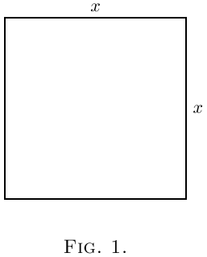
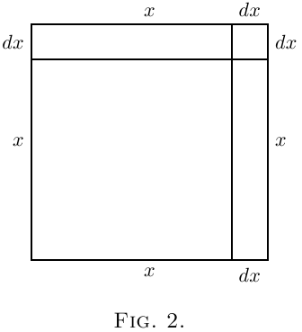
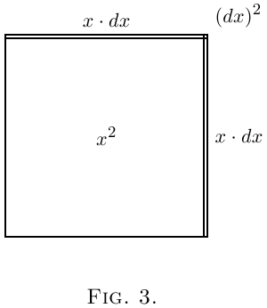

# 第二章 关于不同程度的微小量

在我们的计算过程中，我们会遇到各种不同微小程度的小量。

我们还必须学会在什么情况下可以认为小量是如此微小，以至于我们可以忽略不计。一切都取决于相对的微小程度。

在制定任何规则之前，让我们先想想一些熟悉的例子。一小时有$60$分钟，一天有$24$小时，一周有$7$天。因此，一天有$1440$分钟，一周有$10080$分钟。

显然，与整整一周相比，$1$分钟是一个非常小的时间量。事实上，我们的祖先认为即使与一小时相比，它也是很小的，所以称之为"一分钟"（minute），意思是一个微小的部分——即一小时的六十分之一。当他们需要更小的时间分割时，他们把每分钟分成$60$个更小的部分，在伊丽莎白女王时代，他们称之为"第二分钟"（second minutes，即：第二级微小量）。如今我们把这些第二级微小量叫做"秒"。但很少有人知道它们为什么这样叫。

现在，如果一分钟与整整一天相比是如此之小，那么相比之下，一秒钟又要小多少呢！

再想想一法新（英国旧币，四分之一便士）与一英镑相比：它的价值勉强超过千分之一。与一英镑相比，多一个或少一个法新都是微不足道的：它当然可以被看作是一个*小*量。但是把一法新与1000英镑相比：相对于这个更大的数目，法新的重要性不比千分之一法新对于一英镑的重要性更大。即使是一个金英镑，在百万富翁的财富中也是相对微不足道的量。

现在，如果我们确定任何一个数值分数作为我们在任何目的下称为相对较小的比例，我们就可以很容易地表述出更高微小程度的其他分数。因此，如果就时间而言，把 $\frac{1}{60}$称为一个*小*分数，那么 $\frac{1}{60}$的 $\frac{1}{60}$（即一个*小*分数的*小*分数）就可以被看作是*第二级微小量*。

> 注：数学家们在真正指第二级*微小量*时，却说成第二级"量级"（即：大小）。这对初学者来说是非常令人困惑的。

或者，如果出于某种目的，我们把1%（即$\frac{1}{100}$）作为一个*小*分数，那么1%的1%（即$\frac{1}{10,000}$）就是第二级微小量的小分数；而$\frac{1}{1,000,000}$就是第三级微小量的小分数，即1%的1%的1%。

最后，假设出于某种非常精确的目的，我们把$\frac{1}{1,000,000}$看作"小"量。因此，如果一个一流的精密计时器在一年中的快慢不超过半分钟，它必须保持1/1051200的精确度。现在，如果出于这样的目的，我们把$\frac{1}{1,000,000}$（即百万分之一）看作一个小量，那么$\frac{1}{1,000,000}$的$\frac{1}{1,000,000}$，即$\frac{1}{1,000,000,000,000}$（即万亿分之一）就是第二级微小量，相比之下可以完全忽略不计。

然后我们看到，小量本身越小，相应的第二级微小量就越微不足道。因此我们知道，*在所有情况下，如果我们把第一级小量本身取得足够小，我们就有理由忽略第二级或第三级（或更高级）的微小量*。

但是，必须记住，如果小量在我们的表达式中作为与某个其他因子相乘的因子出现，那么当另一个因子本身很大时，小量可能变得重要。即使是最小的硬币，如果乘以几百，也会变得重要。

现在在微积分中，我们用$dx$表示$x$的一小部分。像 $dx$、 $du$、 $dy$这样的东西称为"微分"，分别是x、u、y的微分。【你读作*dee-eks*、*dee-you*或*dee-wy*。】如果$dx$是x的一小部分，并且本身相对较小，并不能说像$x · dx$、$x^2\, dx$或$a^x\, dx$这样的量是可以忽略的。但是$dx × dx$就是可以忽略的，因为它是第二级微小量。

一个非常简单的例子可以作为说明。

让我们把x看作一个可以增长一小部分而变成 $x + dx$的量，其中$dx$是增长所增加的小增量。它的平方是$x^2 + 2x · dx + (dx)^2$。第二项不可忽略，因为它是一级量；而第三项是第二级微小量，是 $x^2$的一小部分的一小部分。因此，如果我们把$dx$在数值上理解为x的$\frac{1}{60}$，那么第二项就是$x^2$的$\frac{2}{60}$，而第三项就是$x^2$的 $\frac{1}{3600}$。这最后一项显然比第二项不重要。但如果我们进一步把$dx$理解为仅仅是x的$\frac{1}{1000}$，那么第二项将是$x^2$的$\frac{2}{1000}$，而第三项将只是$x^2$的$\frac{1}{1,000,000}$。

   
 
  

从几何上可以这样描述：画一个正方形（[图1](#figure1)），我们用它的边长来表示x。现在假设这个正方形通过在每个方向上增加一小部分dx来增长。放大的正方形由原来的正方形x²、顶部和右侧的两个矩形（每个面积为x·dx，合起来是2x·dx）以及右上角的小正方形(dx)²组成。在[图2](#figure2)中，我们把dx取作x的相当大的一部分——大约$\frac{1}{5}$。但假设我们只取它的$\frac{1}{100}$——大约相当于用细笔画出的墨线的厚度。那么小角落正方形的面积将只有x²的$\frac{1}{10,000}$，实际上看不见。显然，只要我们认为增量dx本身足够小，(dx)²就是可以忽略的。

  

让我们考虑一个比喻。

假设一个百万富翁对他的秘书说：下周我将给你我收到的任何钱的一小部分。假设秘书对他的男孩说：我将给你我得到的一小部分。假设每种情况下的分数都是$\frac{1}{100}$。现在，如果百万富翁先生在下周收到1000英镑，秘书将收到10英镑，男孩将收到2先令。10英镑与1000英镑相比是一个小量；但2先令确实是一个很小的小量，属于非常次要的级别。但是，如果分数不是$\frac{1}{100}$，而是$\frac{1}{1000}$，比例会是什么样呢？那么，百万富翁先生得到他的1000英镑时，秘书先生只能得到1英镑，而男孩得到的不到一法新！

机智的迪安·斯威夫特曾经写道：

```
博物学家观察到，跳蚤
身上有更小的跳蚤在捕食。
而这些跳蚤又有更小的跳蚤来咬它们，
如此无穷无尽地进行下去。
```

> 注：出自《论诗：狂想曲》（第20页），1733年印刷——通常被错误引用。

一头牛可能会为普通大小的跳蚤——第一级微小量的小生物——而烦恼。但它可能不会为跳蚤的跳蚤而烦恼；作为第二级微小量，它是可以忽略的。即使是一打跳蚤的跳蚤对牛来说也算不了什么。

---

> 注：这里的*billion*在旧英式英语中是指10¹²，即现代用法中的trillion（万亿）。

> 注：原文 **Farthing** 是英国旧货币单位，等于四分之一便士（1/4 penny）。它是英国历史上最小面额的硬币之一，1961年才停止流通。**Farthing** 也可用于表示极少量或没有价值的东西，例如"not worth a farthing"表示“一文不值”。

