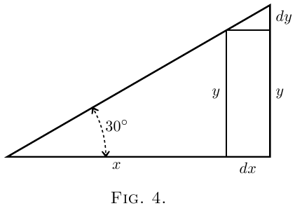
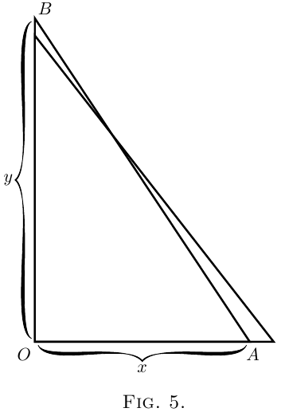

# 第三章 关于相对增长量

在整个微积分中，我们都在处理正在增长的量以及增长的速率。我们把所有的量分为两类：*常数*和*变量*。那些我们视为固定值的量，我们称为*常数*，在代数上通常用字母表前面的字母表示，如 $a$、$b$ 或 $c$；而那些我们认为能够增长的，或者（如数学家所说的）能够"变化"的量，我们用字母表后面的字母表示，如 $x$、$y$、$z$、$u$、$v$、$w$，有时用 $t$。

此外，我们通常同时处理多个变量，并思考一个变量依赖于另一个变量的方式：例如，我们思考抛射物达到的高度如何依赖于达到该高度的时间。或者我们被要求考虑一个给定面积的矩形，并探究其长度的任何增加将如何迫使其宽度相应减少。或者我们思考梯子倾斜角度的任何变化将如何使它所达到的高度发生变化。

假设我们有两个这样相互依赖的变量。一个的改变将带来另一个的改变，*因为*这种依赖关系。让我们把其中一个变量叫做 $x$，把依赖于它的另一个变量叫做 $y$。

假设我们让 $x$ 变化，也就是说，我们改变它或想象它被改变了，通过给它加上一小部分，我们称之为 $dx$。这样我们使 $x$ 变成 $x + dx$。然后，因为 $x$ 已经改变了，$y$ 也将改变，并变成 $y + dy$。这里，$dy$ 这一小部分在某些情况下可能是正的，在其他情况下可能是负的；而且它不会（除非奇迹般地）与 $dx$ 大小相同。

  

*举两个例子。*

(1) 设 $x$ 和 $y$ 分别是直角三角形的底边和高（[图4](#figure4)），其中另一边的倾斜角固定为 $30°$。如果我们假设这个三角形扩大但保持角度与最初相同，那么当底边增长变成 $x + dx$ 时，高变成 $y + dy$。这里，$x$ 的增加导致 $y$ 的增加。高为 $dy$、底为 $dx$ 的小三角形与原三角形相似；显然比率 $\dfrac{dy}{dx}$ 的值与比率 $\dfrac{y}{x}$ 的值相同。由于角度是 $30°$，可以看出这里
$$\frac{dy}{dx} = \frac{1}{1.73}$$

(2) 在[图5](#figure5)中，设 $x$ 表示固定长度梯子 $AB$ 底端距离墙壁的水平距离，设 $y$ 是它在墙上达到的高度。现在 $y$ 显然依赖于 $x$。很容易看出，如果我们把底端 $A$ 从墙壁拉得更远一些，顶端 $B$ 就会下降一点。让我们用科学语言来表述这一点。如果我们把 $x$ 增加到 $x + dx$，那么 $y$ 将变成 $y - dy$；也就是说，当 $x$ 接受一个正的增量时，$y$ 所产生的增量是负的。

  

是的，但是多少呢？假设梯子很长，当底端 $A$ 距离墙壁19英寸时，顶端 $B$ 刚好达到距地面15英尺的高度。现在，如果你把底端再拉出1英寸，顶端会下降多少？把它全部换算成英寸：$x = 19$ 英寸，$y = 180$ 英寸。现在我们称为 $dx$ 的 $x$ 的增量是1英寸：即 $x + dx = 20$ 英寸。

$y$ 会减少多少？新的高度将是 $y - dy$。如果我们用欧几里得定理I. 47计算高度，那么我们就能找出 $dy$ 是多少。梯子的长度是
$$\sqrt{(180)^2 + (19)^2} = 181 \text{ 英寸}$$

显然，新的高度，即 $y - dy$，将是这样的：
\begin{align*}
(y - dy)^2 &= (181)^2 - (20)^2 = 32761 - 400 = 32361, \\
y - dy &= \sqrt{32361} = 179.89 \text{ 英寸}
\end{align*}

现在 $y$ 是180，所以 $dy$ 是 $180 - 179.89 = 0.11$ 英寸。

所以我们看到，使 $dx$ 增加1英寸导致 $dy$ 减少0.11英寸。

$dy$ 与 $dx$ 的比率可以这样表述：
$$\frac{dy}{dx} = -\frac{0.11}{1}$$

也很容易看出，（除了在一个特定位置）$dy$ 的大小与 $dx$ 不同。

现在在整个微分学中，我们在寻找，寻找，寻找一个奇妙的东西，一个纯粹的比率，即当 $dy$ 和 $dx$ 都无限小时，$dy$ 与 $dx$ 的比例。

这里应该注意，我们只能在 $y$ 和 $x$ 以某种方式相关联时才能找到这个比率 $\dfrac{dy}{dx}$，以便每当 $x$ 变化时 $y$ 也会变化。例如，在刚才举的第一个例子中，如果三角形的底边 $x$ 变长，三角形的高 $y$ 也会变大，在第二个例子中，如果梯子脚部距离墙壁的距离 $x$ 增加，梯子达到的高度 $y$ 会相应地减少，开始时缓慢，但随着 $x$ 变大会越来越快。在这些情况下，$x$ 和 $y$ 之间的关系是完全确定的，可以用数学表达，分别为 $\dfrac{y}{x} = \tan 30°$ 和 $x^2 + y^2 = l^2$（其中 $l$ 是梯子的长度），$\dfrac{dy}{dx}$ 在每种情况下都有我们找到的意义。

如果，$x$ 仍然如前所述是梯子脚部距离墙壁的距离，而 $y$ 不是达到的高度，而是墙壁的水平长度，或其中砖块的数量，或自建造以来的年数，那么 $x$ 的任何改变自然不会引起 $y$ 的任何改变；在这种情况下，$\dfrac{dy}{dx}$ 完全没有意义，也不可能找到它的表达式。每当我们使用微分 $dx$、$dy$、$dz$ 等时，都暗示着 $x$、$y$、$z$ 等之间存在某种关系，这种关系被称为 $x$、$y$、$z$ 等的"函数"；例如，上面给出的两个表达式，即 $\dfrac{y}{x} = \tan 30°$ 和 $x^2 + y^2 = l^2$，是 $x$ 和 $y$ 的函数。这样的表达式隐含地（即，不明显地显示而包含）包含了用 $y$ 表示 $x$ 或用 $x$ 表示 $y$ 的方法，因此它们被称为 $x$ 和 $y$ 的*隐函数*；它们可以分别写成以下形式：

$$
\begin{aligned}
y &= x \tan 30^\circ \quad \text{or} \quad x = \frac{y}{\tan 30^\circ} \\
\text{and} \quad y &= \sqrt{l^2 - x^2} \quad \text{or} \quad x = \sqrt{l^2 - y^2}.
\end{aligned}
$$

这些最后的表达式明确地（即，清楚地）表述了用 $y$ 表示的 $x$ 的值，或用 $x$ 表示的 $y$ 的值，因此它们被称为 $x$ 或 $y$ 的*显函数*。例如，$x^2 + 3 = 2y - 7$ 是 $x$ 和 $y$ 的隐函数；它可以写成 $y = \dfrac{x^2 + 10}{2}$（$x$ 的显函数）或 $x = \sqrt{2y - 10}$（$y$ 的显函数）。我们看到，$x$、$y$、$z$ 等的显函数简单地说就是当 $x$、$y$、$z$ 等变化时其值会改变的东西，无论是一次一个还是几个一起变化。因此，显函数的值被称为*因变量*，因为它依赖于函数中其他变量的值；这些其他变量被称为*自变量*，因为它们的值不是由函数所假定的值决定的。例如，如果 $u = x^2 \sin \theta$，$x$ 和 $\theta$ 是自变量，$u$ 是因变量。

有时几个量 $x$、$y$、$z$ 之间的确切关系要么是未知的，要么不便于表述；只是知道，或方便表述，这些变量之间存在某种关系，所以不能单独改变 $x$ 或 $y$ 或 $z$ 而不影响其他量；$x$、$y$、$z$ 中函数的存在则用记号 $F(x, y, z)$（隐函数）或 $x = F(y, z)$、$y = F(x, z)$ 或 $z = F(x, y)$（显函数）来表示。有时使用字母 $f$ 或 $\phi$ 代替 $F$，所以 $y = F(x)$、$y = f(x)$ 和 $y = \phi(x)$ 都表示同一件事，即 $y$ 的值以某种未说明的方式依赖于 $x$ 的值。

我们把比率 $\dfrac{dy}{dx}$ 称为"$y$ 关于 $x$ 的*微分系数*"。这是对这个非常简单的东西的一个庄严的科学名称。但是当事物本身如此简单时，我们不会被庄严的名称吓到。我们不会被吓到，而是简单地对给出冗长拗口名称的愚蠢行为简短地咒骂一句；在舒缓了我们的心情之后，我们将继续研究这个简单的东西本身，即比率 $\dfrac{dy}{dx}$。

在你们在学校学过的普通代数中，你们总是在寻找一些叫做 $x$ 或 $y$ 的未知量；有时有两个未知量需要同时寻找。现在你们必须学会用一种新的方式去寻找；现在被寻找的目标既不是 $x$ 也不是 $y$。相反，你们必须寻找这个叫做 $\dfrac{dy}{dx}$ 的奇妙小东西。找到 $\dfrac{dy}{dx}$ 值的过程叫做"求导"。但是，记住，所需要的是当 $dy$ 和 $dx$ 本身都无限小时这个比率的值。微分系数的真正值是在极限情况下它所接近的值，此时每一个都被认为是无穷小的。

现在让我们学习如何寻求 $\dfrac{dy}{dx}$。

## 如何读微分

绝不能犯学童的错误，认为 $dx$ 意味着 $d$ 乘以 $x$，因为 $d$ 不是一个因子——它意味着"一个元素"或"一小部分"后面跟着的任何东西。$dx$ 这样读："*dee-eks*"。

如果读者在这些问题上没有人指导，这里可以简单地说明微分系数的读法如下。微分系数

$\dfrac{dy}{dx}$ 读作"*dee-wy by dee-eks*"或"*dee-wy over dee-eks*"。

同样，$\dfrac{du}{dt}$ 读作"*dee-you by dee-tee*"。

二阶微分系数稍后会遇到。它们是这样的：$\dfrac{d^2 y}{dx^2}$；*读作"dee-two-wy over dee-eks-squared"*，它意味着对 $y$ 关于 $x$ 求导的运算已经（或必须）执行两次。

表示函数已被微分的另一种方式是在函数符号上加一个重音符号。因此，如果 $y=F(x)$，这意味着 $y$ 是 $x$ 的某个未指定函数（见[这里](3.html#function)），我们可以写 $F'(x)$ 而不是 $\dfrac{d\bigl(F(x)\bigr)}{dx}$。同样，$F''(x)$ 将意味着原函数 $F(x)$ 已经关于 $x$ 被微分了两次。
